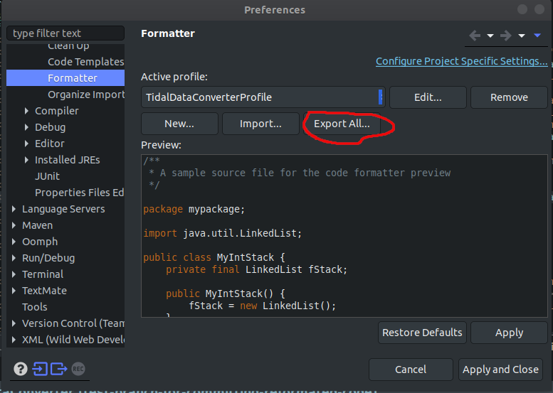

# TidalDataConverter

## About
Tidal data converter console application is built using SpringBoot framework.

## How to run your application (IntelIJ IDEA)
This repo is set up to run in IntelIJ IDEA

### Steps:
1. Open project using IntelIJ IDEA
2. In <i>View > Tool Windows</i> menu select Terminal
3. In Terminal window enter `mvn clean compile` command and press Enter
4. In Top Toolbar select <i>Run > "Run TidalDataConverterApplication"</i> option or just press Shift + F10

## Logging using log4j2.xml
In this application log4j2 XML configuration is used to be able to reconfigure logging levels once application has been  compiled.
log4j2 supports following custom log levels:
* OFF
* FATAL
* ERROR
* WARN
* INFO
* DEBUG
* TRACE
* ALL

In order to preform root/package level logging following steps need to be taken:

* Open `log4j2-bluehouseinc.xml` file located in src/main/resources directory.
* Under `<Loggers>` section there are `<AppenderRef>` tags which can be uncommented/commented-out in order to  enable/disable logging based on package levels (more info is located in comments located in mentioned file).
* User can manually set which package level (e.g. `com` / `com.bluehouseinc` / `com.bluehouseinc.dataconverter`)  needs to be logged by setting value in `<Property name="PACKAGE_NAME">` tag.

<b>NOTE</b>: In order for mentioned configuration file to take effect it is mandatory to recompile the application!

## Formatting
This project is using [Spotless Maven plugin](https://github.com/diffplug/spotless/tree/main/plugin-maven) in order to use proper formatting.
This helps development team use same format styling for better and easier code readability.
Formatting will be automatically performed when `git commit` command is being executed, i.e. changes are being committed.

Formatting rules are located in [TidalDataConverter-formatter.xml](https://github.com/NEXRY-LLC/TidalDataConverter/blob/master/TidalDataConverter-formatter.xml) file which is necessary to save all formatting rules created by Eclipse.
File can be modified by using Eclipse IDE GUI tool in following way:
1. Navigate to *Window* > *Preferences*
2. Navigate to *Java* > *Code Style* > *Formatter*
3. Click on *Import Button* and locate TidalDataConverter-formatter.xml file (inside of root directory of your project) + click *OK* button once you choose mentioned file
4. Click on *Edit* button and new window will appear (just wait few seconds)
5. On left-hand side you will see formatting rules which you can adjust. On right-hand side you will see live-preview of selected changes you made of left-hand side.
6. Once you are done make sure to click on *Apply* buttons wherever it is needed.
7. Since code format styling should be consistent it is necessary to share this modified file. This is done by clicking on click *Export All* button (screenshot below) and save it into a same XML file in project's root directory.

  **IMPORTANT**: Make sure to commit modified `TidalDataConverter-formatter.xml` file and push it to remote repository!